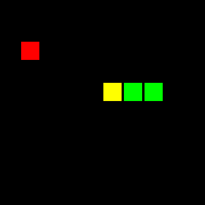

# Snake v01


Implementation of the Genetic Algorithm for creating a Snake AI in Rust.

This has been an attempt at learning the Rust language, and using it as a way to learn some concepts of Machine Learning, Data Parallelism, and Game Design. 

## Demo



## How to play

```
$ git clone https://github.com/const-i/snake_01.git
$ cd snake_01
$ cargo run
```


## License

See the [LICENSE](./LICENSE) file for license rights and limitations.
