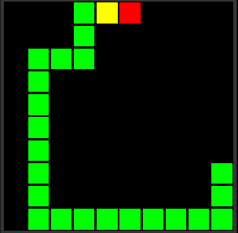

# snake_01

Implementation of the Genetic Algorithm for creating a Snake AI in Rust.

This has been an attempt at learning the Rust language, and using it as a way to learn some concepts of Machine Learning, Data Parallelism, and Game Design. 

## Demo

